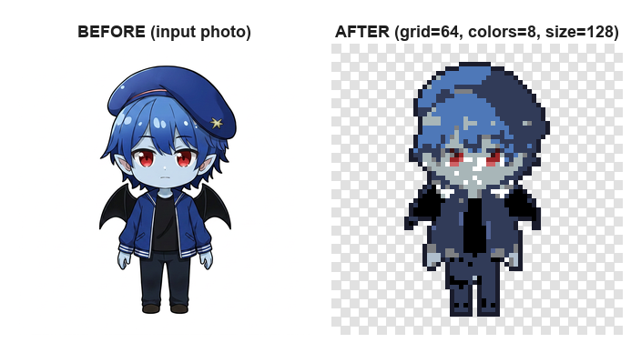
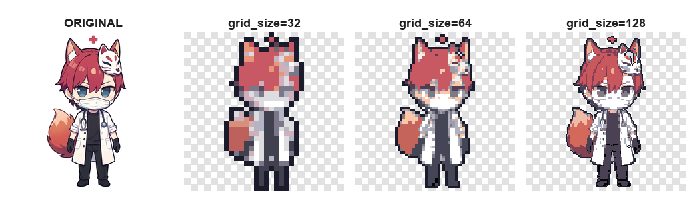
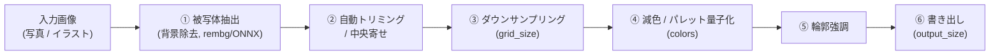
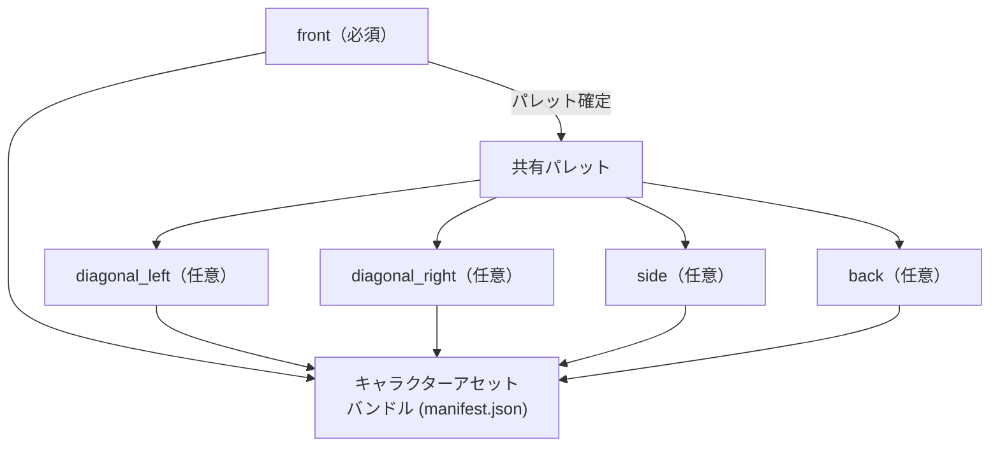

# img_to_pixcel_app (PixelForge)

任意のキャラクター画像（写真・イラスト・背景ありの画像を含む）から、レトロ風ドット絵（ピクセルアート）キャラクター画像を自動生成するローカルWebアプリ。

> A deterministic image-processing pipeline that turns any character photo/illustration into a retro pixel-art sprite — background removal → crop/center → downsample → color quantization → outline enhancement.

3プロジェクトから成るパイプラインの1段目にあたるツール（[agent-village](https://github.com/Afarg/agent-village) のダッシュボードで使うピクセルキャラクターを生成する、生成物は [ani_convert_app](https://github.com/Afarg/ani_convert_app) がまばたき・歩行アニメーションの差分フレームを作る際の入力にもなる）。単体でも汎用的な「画像→ピクセルキャラ」変換ツールとして使える。

## 実際の変換結果



`grid_size` を変えると、ディテールの再現度が変わる（`colors=8` / `output_size=128` 固定）。



## これは何に使うか（用途）

- ゲームやダッシュボードで使う「自分だけのピクセルキャラクター」を、写真やAI生成イラストから作りたいとき。
- 複数人分のキャラクターアイコンを、同じ解像度・同じパレット規則で統一的に量産したいとき（[agent-village](https://github.com/Afarg/agent-village) ではエージェントごとのアイコンとして使用）。
- 「背景込みの1枚の写真」から、背景を自動で切り離してキャラクターだけを抽出したい場合。手動での背景消しやトリミングが不要になる。

## 図解: 変換パイプライン



**複数アングル入力**（フェーズ2・3）の場合、正面(front)を先に変換してパレットを確定させ、斜め(diagonal_left/right)・横向き(side)・後ろ向き(back)は同じパレットを共有して変換する。これにより全アングルで色が揃う。



## 特徴

- **背景除去 → 自動トリミング/中央寄せ → ダウンサンプリング → 減色/パレット量子化 → 輪郭強調 → 書き出し**という決定論的パイプライン（AI生成は使わず、無料・オフラインで完結）。
- 画像アップロード → 自動処理 → プレビュー → パラメータ調整（`grid_size` / `colors` / `output_size`）→ エクスポート、という一連のUIを持つローカルWebアプリ。
- 正面のみ（フェーズ1）／正面＋斜め（フェーズ2）／正面＋斜め＋横向き＋後ろ向き（フェーズ3・フル）という3段階の入力構成に対応。1枚の画像から未提供のアングルを捏造することはしない、という方針を徹底。
- 「入っていない情報は作らない」という一貫した設計方針（詳細は `docs/design/` 参照）。

## 使い方

### セットアップ

```bash
python -m venv .venv
.venv/Scripts/activate   # Windows: .venv\Scripts\activate / macOS・Linux: source .venv/bin/activate
pip install -r requirements.txt
uvicorn app.main:app --reload
```

`http://127.0.0.1:8000/` を開くとプレビューUIが使える。

### APIとして直接呼び出す場合

```bash
curl -X POST http://127.0.0.1:8000/api/convert \
  -F "front=@my_photo.png" \
  -F "grid_size=32" \
  -F "colors=8" \
  -F "output_size=128" \
  -F "outline=true"
```

| パラメータ | 説明 | 主な選択肢 |
|---|---|---|
| `front` | 正面画像（必須） | PNG/JPG |
| `diagonal_left` / `diagonal_right` / `side` / `back` | 追加アングル（任意） | PNG/JPG。2枚以上提供するとキャラクターアセットバンドル（zip）も生成される |
| `grid_size` | ピクセル化のグリッド解像度 | 32 / 64 / 128（16〜24は腕・脚が潰れやすいため非推奨） |
| `colors` | 減色後の色数 | 8 / 10 |
| `output_size` | 出力画像サイズ(px) | 64 / 128 |

レスポンスには各アングルの変換前後プレビューURL、`manifest.json`、（複数アングル時は）`bundle.zip` のURLが含まれる。この `bundle.zip` がそのまま [ani_convert_app](https://github.com/Afarg/ani_convert_app) の入力になる。

## 技術スタック

- Python / FastAPI（`uvicorn`）
- 画像処理: Pillow, `rembg`（背景除去, ONNX Runtime）, NumPy, SciPy

## ドキュメント

設計ドキュメント一式は `docs/design/` にあり、全体像・アーキテクチャ・変換パイプラインの詳細設計・制約事項・Agent Villageとの連携方法・複数アングル入力の仕様をカバーしている。

| ドキュメント | 内容 |
|---|---|
| `00-overview.md` | 全体像・スコープ・動機 |
| `01-architecture.md` | システム構成・技術スタック・配布形態 |
| `02-conversion-pipeline.md` | 画像→ピクセルアート変換パイプラインの詳細設計 |
| `03-environment-and-setup.md` | 環境構築手順 |
| `04-constraints-and-limitations.md` | 制約・入力画像のガイドライン・既知の限界 |
| `05-agent-village-integration.md` | Agent Villageへの取り込み方法 |
| `06-multi-angle-input.md` | 3フェーズ構成・複数アングル入力の仕様 |

## 既知の課題・改善計画

現状の課題と修正方針は [`IMPROVEMENTS.md`](IMPROVEMENTS.md) にまとめている。
