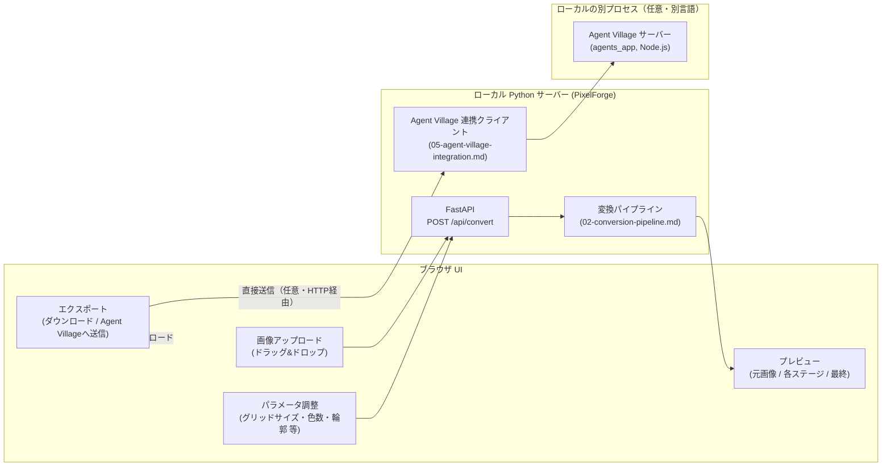

# 01. アーキテクチャ — PixelForge

対象読者: 実装者。
関連: `00-overview.md`（スコープ）、`02-conversion-pipeline.md`（内部処理の詳細）。

---

## 1. 全体構成方針

**画像処理コアはPythonで実装する**（2026-07-27、ユーザーと合意）。

当初はAgent Villageと同じNode.js構成を検討していたが、画像処理・背景除去の分野はPythonのエコシステム（Pillow / OpenCV / NumPy / `rembg`）が本場であり、圧倒的に成熟している。実際、Node向けの背景除去パッケージを調査した際に見つかった選択肢の一つ（`@harshit_01/ai-bg-remover`）も、内部では結局Pythonスクリプト（`rembg`+`opencv-python`）を`child_process`経由で呼び出しているだけだった（`01-architecture.md`旧版の調査結果）。無理にNode縛りにする理由は薄いと判断した。

方針：

- **サーバー・画像処理とも Python** で実装する（FastAPI + Pillow/NumPy + `rembg`）。
- **フロントエンドは素のHTML/CSS/JS**（ビルド不要）とし、「軽量サーバー + ブラウザ」というAgent Villageと同じ操作感（コマンド実行→ブラウザ自動起動）は維持する。ユーザーが慣れている運用パターン（`docs/operations-guide.md`）をNode/Python問わず踏襲する。
- PixelForgeは元々Agent Villageとは独立した汎用ソフトという方針（`00-overview.md` §1）なので、Node.jsとの言語統一にこだわる必要は無い。**唯一のトレードオフは、導入手順がAgent Village（Node.js）とPixelForge（Python）で2種類に分かれること**であり、これは`03-environment-and-setup.md`で明確に案内する。

## 2. コンポーネント構成



PixelForgeはAgent Villageと**プロセスとして完全に独立**している。言語も別（PixelForge=Python、Agent Village=Node.js）だが、連携（AVClient）は単純なHTTPリクエスト（multipartアップロード）なので、言語が違っても支障はない（`05-agent-village-integration.md`）。Agent Villageが起動していなくてもPixelForge単体で完結して動く。

## 3. 技術スタック

| 層 | 技術 | 理由 |
|---|---|---|
| サーバー | Python 3.10+ / FastAPI + uvicorn | 非同期対応・自動ドキュメント生成があり、画像アップロードのような単純なAPIを書くのに十分軽量。Flaskでも代替可（好みの範囲、実装時にどちらかに決める） |
| 画像処理コア | `Pillow`（PIL） | リサイズ・クロップ・パレット量子化（`Image.quantize()`）まで標準機能で完結する。追加の減色専用ライブラリが不要になった（旧版のRgbQuant.js相当の機能を内蔵） |
| 被写体抽出（背景除去） | `rembg`（MITライセンス、実在確認済み） | `pip install rembg`のみで導入でき、モデル（u2net/u2netp/isnet-general-use等）は初回実行時に`~/.u2net/`へ**自動ダウンロードされる**。完全ローカルで動作し、クラウドAPI費用は発生しない（`04-constraints-and-limitations.md` §2） |
| 数値・境界計算 | `NumPy` | bounding box計算、輪郭強調（アルファ境界の走査）等、Pillowだけでは書きにくい処理の補助 |
| フロントエンド | 素のHTML/CSS/JS（ビルド不要） | Agent Villageの`public/`と同じ方針。Canvas APIでプレビュー描画 |
| アップロード受信 | `python-multipart`（FastAPI利用時） | FastAPIでファイルアップロードを受けるための標準的な追加パッケージ |
| Agent Villageへの直接送信 | `requests` または `httpx` | Node.js側のExpress API（`/api/agents/:id/sprite`）へ、言語をまたいで素直にHTTP POSTするだけ |

いずれも実在するパッケージであることをドキュメント調査で確認済み（`03-environment-and-setup.md` §2）。`rembg`のライセンスはMITと確認できたが、内部で使うモデル**重み**自体のライセンスは別途確認が必要（`04-constraints-and-limitations.md` §1）。

## 4. なぜAI生成を今回コアに含めないか

ユーザーとの合意（2026-07-27時点）により、**コア機能は決定論的パイプラインのみ**とする。

| 観点 | 決定論的パイプライン（採用） | AI生成（将来オプション） |
|---|---|---|
| 追加コスト | なし | クラウドAPI利用なら従量課金、ローカルGPU推論ならVRAM要件 |
| オフライン動作 | ✅ 可能 | ❌ 多くの場合クラウド依存、ローカルでも大きなモデル配布が必要 |
| 出力の再現性 | ✅ 決定論的（同じ入力→同じ出力） | ❌ 生成のたびに変わりうる |
| Agent Villageの仕様（正方形・色数）への適合 | ✅ パイプライン自体が保証する | ❌ 別途、後処理での適合が必要 |
| 見た目の完成度（特に複雑な写真） | 中（シルエット・配色ベース） | 高（絵としての破綻が少ない） |

将来「AIでもっと絵として自然に描き直したい」というニーズが出た場合は、パイプラインの①被写体抽出後の画像を外部の画像生成サービス（Pythonエコシステムであれば`diffusers`等も選択肢に入る）に渡し、その出力を同じ④減色/⑥書き出しステージに通す、という**差し込み型の拡張**として設計しておく（`02-conversion-pipeline.md`のPipelineに「AIリスタイルステージ（任意）」を挿入できる形にする）。これによりコア機能の決定論的な性質を壊さずに拡張できる。

## 5. 実行形態

```bash
cd pixel-forge
python -m venv .venv
.venv\Scripts\activate        # Windows（macOS/Linuxは source .venv/bin/activate）
pip install -r requirements.txt
uvicorn app.main:app --port 4273
# → http://localhost:4273 をブラウザで開く
```

Agent Villageと同時に動かす前提のため、既定ポートは4173（Agent Villageの既定値）と衝突しない値にする（例: 4273）。`docs/operations-guide.md`で確立した「プロジェクト/ツールごとにポート番号を固定する運用」と一貫させる。
