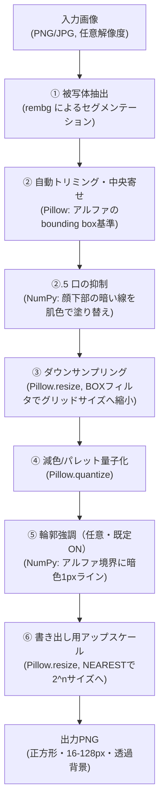

# 02. 変換パイプライン設計 — PixelForge

対象読者: 実装者。
関連: `01-architecture.md`（技術スタック）、`04-constraints-and-limitations.md`（失敗時の挙動・入力ガイドライン）。

---

## 1. パイプライン全体像

## 2. 各ステージの詳細

### ① 被写体抽出（背景除去）

- ユーザーの要望どおり、入力画像に背景が混ざっていても自動的にキャラクターのみを抽出する。**ここが全体の変換精度を左右する最重要ステージ。**
- 手法: `rembg`（Python、内部でu2net/isnet系のONNXモデルを使用）を呼び出し、アルファマスク（透過PNG）を得る（`01-architecture.md` §3）。モデルは`rembg`が初回実行時に自動ダウンロードするため、手動でのモデル配置は不要（`03-environment-and-setup.md` §3）。
- 失敗時の扱い: マスクの信頼度が低い（前景と判定された面積が画像全体に対して極端に小さい/大きい等）場合は、警告を出しつつ元画像全体を使うフォールバックに倒す（`04-constraints-and-limitations.md` §4）。**エラーで処理を止めない**方針とする（Agent Village本体の「hookの失敗は握りつぶし、本来の処理を止めない」という既存方針、`05-hooks-state-writer.md` §3.5、と一貫させる）。

> **更新履歴（実機検証で判明・修正済み）**: ユーザー報告により、**白い服のキャラクターで、背景除去後の縁が黒く滲む**不具合が実機で見つかった。原因は`rembg`の出力仕様: PILの画像モードは`"RGBA"`（ストレートアルファ）と表示されるが、**実際のピクセルデータはpremultiplied alpha（色にアルファ値を掛け合わせた状態）になっている**ことを実測で確認した（例: 本来白(255,255,255)であるべき縁のピクセルが、アルファ値10のとき`RGB=(10,10,10)`、アルファ値49のとき`RGB≈(48,49,49)`など、`R≈G≈B≈alpha`という明確なpremultiplied特有のパターンを示していた）。PILのモード表記が`"RGBA"`（`"RGBa"`ではない）のため、Pillow側で自動的にストレートアルファへ変換されることもなく、後続の全ステージがこの「アルファで暗く潰れた色」をそのまま処理してしまっていた。暗い色の服では目立たなかったが、白・明るい色の服では縁が真っ黒に滲んで見え、ユーザー報告で顕在化した。
> - **修正**: `remove_background()`内で、`rembg`の出力を受け取った直後にunpremultiply処理（`true_RGB = premultiplied_RGB × 255 / alpha`）を行うようにした。以降の全ステージは常にストレート（un-premultiplied）な色を前提にできる。
> - 白いラボコートを着た実キャラクターで、修正後は縁の黒滲みが解消されることを確認済み。

> **更新履歴2（2026-08-16、実機検証で判明・修正済み）**: ユーザー報告（business-character-c、色白のオフィスカジュアル女性）により、**脚部に不自然な透過の穴が散在する**不具合が見つかった。原因はunpremultiply後も残る`rembg`自身の**アルファ「信頼度」の低さ**: 背景（無地の薄灰色）と低コントラストな部位（色白の肌）では、`rembg`(u2netp)が広い内部領域に低いアルファ値（実測1〜50程度、最小1）しか割り当てないことがあった。`pre.png`単体では気づきにくい（ほぼ白い肌が白いビューア背景に低不透明度で合成されても見た目はほぼ変わらないため）が、③のダウンサンプリングがセル単位でMAX-pooling+閾値60の二値化を行うため、**セル内の全画素がその閾値を下回ると当該セルが完全に透過になる**ことで顕在化した。
> - **試行錯誤の記録**（実装は`fix-verify-loop`スキルの手順に従わず筆者本人が代行。サブエージェント3体が引き続き`Agent`ツールから呼び出せなかったため、§4/§7既知の制約と同じ状況）:
>   1. 「アルファが非ゼロなら被写体」とみなし`scipy.ndimage.binary_fill_holes`で穴埋め → 真の背景は実測で厳密に0だったため一見有効に見えたが、**同じキャラクターの両脚の間の隙間も同程度に低いアルファ**（1〜50程度、厳密な0ではない）だったため、隙間ごと埋めて両脚が1つの塊に融合する新たな不具合を招いた。
>   2. アルファに加え「元画像の色が背景色（四隅からサンプリング）から一定距離以上離れているか」を条件に追加 → 脚の肌色(252,216,196)と真の隙間の色(221,221,222≒背景そのもの)は正しく分離できたが、**既存の4キャラクター（テストキャラクターA〜D）への回帰確認で新たな誤爆を発見**: あるキャラクターの靴の下に描かれた**影の楕円**(154,150,150)が、地の肌色より大きい距離で背景と異なると判定され、影ごと不透明化されて足元にグレーの染みが出現した。
>   3. 「`rembg`の高信頼度画素からの距離」を追加条件にする案も試したが、影が靴に直接接して描かれているため、脚内部の穴と同程度に信頼画素へ近く、幾何学的な距離では分離できなかった。
>   4. 最終的に**クロマ（`max(R,G,B)-min(R,G,B)`、彩度に近い指標）**で判別: 背景が無地の**無彩色**グレーである以上（`docs/prompt/*-generation-prompts.md` §0.1）、その上に落ちる影も「同じ無彩色のまま暗くなる」だけでクロマは変化しない（実測: 影のクロマ=4、背景の四隅で実測したクロマも6キャラクター全てで2〜4）。一方、肌・髪・服の色は無彩色ではありえない（脚の肌のクロマ=56）。「弱いアルファ(<60)かつクロマ15以上」の画素だけを元画像の色で不透明化するよう`remove_background()`を修正し、既存4キャラクター(§10)・新規4キャラクター(§13〜§14)の計8キャラクター×12パターン=96パターンで再検証: **影の誤爆はゼロ件に解消しつつ、脚部の穴も完全に解消**（テストキャラクター側は不透明度比率が1パターンも変化せず、影の誤爆が疑わしかったキャラクターB/Aの微小な差分も全て解消したことを確認）。
> - **既知の限界**: 白シャツ・黒靴・グレーのスーツ等、**無彩色の部位**で同種の低信頼度ドロップアウトが起きた場合はクロマ判定を通過できず対象外（`04-constraints-and-limitations.md`に追記済み）。今回の8キャラクター×12パターン検証では未観測。

### ② 自動トリミング・中央寄せ

- ①で得たアルファチャンネルの非透過領域のbounding boxを計算し、上下左右に均等な余白（例: 各辺10%）を持たせて正方形にクロップする。
- 目的: 元画像内でキャラクターがどこにあっても、以降のグリッドを最大限キャラクターに使えるようにする（ユーザーが指摘した「精度を上げる」ための直接的な施策）。
- **バリデーション（実装済み・実機検証済み）**: bounding boxの幅/高さ比が閾値（既定0.75）を超えたらエラーにする（`UnsupportedPoseError`）。Tポーズ・腕を広げた構図は幅が高さに対して大きくなり、正方形クロップで胴体・脚が縦方向に圧縮された不自然な結果になることが実機で確認されたため（`04-constraints-and-limitations.md` §3.1）。

### ②.5 口の抑制（2026-07-29追加・ユーザー要望）

**背景**: 「口があると感情が入ってしまい、キャラを見る側に影響が出る可能性がある」というユーザーの方針により、キャラクターの口を常に非表示にする（口の代わりに肌色で塗りつぶす）ステージを追加した。②（トリミング）の直後、③（ダウンサンプリング）の前に実行し、以降の全ステージ・全ビュー（正面・斜め左右・横向き・後ろ向き）が最初から「口の無い」高解像度画像を前提に処理できるようにする。副次効果として、`ani_convert_app`が読み込む`pre.png`（`06-multi-angle-input.md` §5）も最初から口が無い状態になるため、まばたき・歩行アニメーション側で追加対応する必要が無い。

**検出方式**（`app/mouth.py`の`suppress_mouth()`）: 実キャラクターで実測したところ、口は**目のような鮮やかな色ではなく、肌よりも暗いグレー系の線**（RGB各chがほぼ等しい）であることを確認した（`ani_convert_app/app/blink.py`の目検出が彩度ベースなのとは対照的）。そのため「肌色より暗い」ことを信号にする。

> **更新履歴（実機検証で判明・修正済み）**: 当初は「口がありそうな帯（bounding boxの40%〜62%）」を1つだけ設定し、その帯自身の中央値輝度を「肌の基準」として使っていたが、実キャラクターで検証したところ**帯がジャケットの襟元まで届いてしまい、暗い襟の画素が中央値を押し下げ、本物の口が『肌より暗い』と判定されなくなる**（何も塗られない）ことが判明した。`ani_convert_app/app/walk.py`の`shift_fraction`修正と同じ教訓（bounding boxの単純な比率指定は、服がその境界を越えて伸びていると汚染される）。
>
> 対応として、**帯を2つに分離**した: 目のすぐ下の狭い帯（`skin_reference_band`、既定0.40〜0.44）を**肌色の基準取得専用**とし、実際に口を探す帯（`mouth_search_band`、既定0.44〜0.56）とは別にした。探索帯がどれだけジャケット等で汚染されても、基準帯自体は汚染されないため安定する。塗りつぶし後もアンチエイリアスの縁がうっすら残る問題も見つかり、検出領域を1pxだけ膨張（`scipy.ndimage.binary_dilation`）させてから塗ることで解消した（この縁は高解像度の中間画像でのみ見え、③のダウンサンプリング後は元々ほぼ消えるレベルだったが、念のため対処した）。
>
> 実機検証: 実キャラクターで口の完全消失（③以降の最終ピクセルアートで痕跡なし）、`grid_size=32`・`64`双方、正面+斜め左+斜め右の3ビュー全てで色パレットの一貫性（`06-multi-angle-input.md` §5）にも影響が無いこと、`ani_convert_app`側のまばたき検出（`app/blink.py`の`detect_eyes()`）が引き続き正常に動作することを確認済み。

**既知の限界**: 目のような彩度ベースの検出ではなく「肌より暗い、顔の下部中央にある小さな塊」という位置・明暗ベースのヒューリスティックのため、以下では機能しない可能性がある。

- 口が肌と同程度の明るさ、または肌より明るい色で描かれているデザイン
- 前髪・マフラー等が`skin_reference_band`（目のすぐ下）にかかり、基準色そのものが肌色でなくなる場合
- 2頭身から大きく外れる、または目・口の位置関係が典型的でないデザイン

無理に検出せず（`min_area`〜`max_area`の範囲に収まる暗い塊が見つからなければ何もしない）、フェイルソフトの方針は他の検出処理と同じ。

### ③ ダウンサンプリング

- 目標グリッドサイズ（既定16×16、設定で32×32等に変更可能）へ縮小する。
- **単純なnearest-neighbor縮小は使わない。**

> **更新履歴（実機検証で判明・修正済み）**: 当初案（PillowのBOX平均リサイズ→アルファを閾値128で二値化）を実装したところ、実際のキャラクターで**腕・脚のような細い部位が縮小時に消える/縁の色が濁る**という不具合が実機で見つかった（ユーザー報告）。原因は2つ：(a) 細い部位は1セルに対する被覆率が低く、平均化すると閾値未満になって消えてしまう、(b) 透明な背景ピクセルのRGB値がそのまま平均に混ざり、縁の色が濁る。以下の方式に変更して緩和した。

- **アルファは最大値プーリング**: 各出力セルに対応する元画像の領域のうち、**最大のアルファ値**を採用する（平均ではない）。「そのセルに少しでもキャラクターが触れていれば残す」という考え方で、細い部位が平均化で消えるのを防ぐ。
- **色はアルファで重み付けした平均**: 透明ピクセル（アルファ0）は重み0として色の平均から除外する。これにより縁の色に透明部分の色が混ざらない。
- 閾値は128→60に緩和（最大値プーリングと組み合わせることで、細い部位も残りやすくする）。
- **既知の限界**: これでも16×16グリッドでは腕・脚が体のシルエットと一体化しがちで、要素の多いキャラクターは32×32・色数10程度まで上げないと腕・脚が読み取れるレベルにならないことを実機で確認した（`04-constraints-and-limitations.md` §2に追記）。根本的にはグリッド解像度の限界であり、この方式変更だけで全て解決するわけではない。

> **更新履歴2（実機検証で判明・修正済み）**: 別のユーザー報告により、①のpremultiplied alpha修正（後述）を適用した後もなお、**服のボタン・縫い目など細かい黒線画が多いキャラクターで、白い部分がグレーに濁って見える**不具合が見つかった。①の修正では解消しなかったため、①ではなく本ステージ（③）に根本原因があると判断し、実際にダウンサンプリング直後の画像を直接確認して特定した。
>
> **原因**: 「白い生地＋細い黒線」が1つの出力セルに混在する場合、アルファ加重平均は両者を単純にブレンドしてグレーにしてしまう。これは2色が1セルに同居する限り、どんな平均処理でも起きる。
>
> **試行錯誤**:
> 1. 平均→**モード（そのセルで一番多い色）**に変更したところ、線画の濁りは解消したが、**別のキャラクターで目の色が完全に消える**という新しい退行が発生した（目のような「セル内で少数派だが重要な色」は、モード方式だと多数派の肌色に負けて完全に落とされてしまうため）。
> 2. 最終的に、**「暗い色がそのセルの少数派である場合だけ、色の平均から除外する」**方式に変更した。細い黒線は大抵どのセルでも少数派なので除外され、白一色として扱われる（レトロなドット絵で細い線画が解像度不足で失われるのは様式として自然）。一方、目の赤のような「暗くない色」の少数派は除外対象にならず、これまで通り平均に反映されるため、`04-conversion-pipeline.md` §4のMAXCOVERAGEが引き続き拾える。暗い色がそのセルの**多数派**（本当に暗い服・髪影など）の場合は除外せず、そのまま暗い色として扱う。
> 3. 両方の実キャラクター（線画の多い服／目の小さい色）で同時に問題が解消することを実機で確認済み。

### ④ 減色/パレット量子化

> **更新履歴（実機検証で判明・修正済み）**: 当初案（`FASTOCTREE`でRGBAをそのまま量子化）を実装したところ、実際のイラストで**顔のような小さいが重要な領域の色が完全に消える**という不具合が実機で見つかった。原因は2つ複合していた：(a) ③のBOX縮小でできた輪郭の半透明ピクセルがアルファも量子化対象に含めてしまい、パレット枠を輪郭のグラデーションに浪費していた、(b) 面積の大きい暗い色（髪・服）にパレットが偏り、面積の小さい顔の色が枠を確保できず周囲の暗い色に吸収されていた。以下の2点を修正して解消した。

- **アルファは二値化してから色の量子化とは完全に分離する**: ③のダウンサンプリング直後にアルファチャンネルを閾値（既定128）で二値化（完全不透明/完全透明のみ）する。これにより半透明の輪郭ピクセルが色空間の量子化を乱さなくなる。
- **色の量子化はRGBのみに対して行う**: アルファを分離しているため、`MEDIANCUT`/`MAXCOVERAGE`（RGBAを扱えないためFASTOCTREE一択、という当初の制約）が使えるようになった。`Image.quantize(colors=N, method=Quantize.MAXCOVERAGE, dither=Dither.NONE)`を採用する。`MAXCOVERAGE`は単純な画素数の多さだけでなく、画像内に存在する色をなるべく取りこぼさない（＝面積の小さい色にも枠を残しやすい）方式で、顔の色が消える問題を解消できることを実機で確認した。
  - `dither=Dither.NONE`にする（既定の`FLOYDSTEINBERG`ディザリングは中間色を斑上に混ぜてドット絵特有のクッキリした塗り分けを損なうため、あえて切る）。
  - 既定の色数は6（`01-visual-concept.md` §1.3「1スプライトは4色以内」との整合を意識した値）。キャラクターが複雑な場合は8〜10程度に増やすとディテールが残りやすい（実装時にUIで調整可能にする、§3のパラメータ表参照）。
- モードを2つ用意する:
  - **汎用モード**: 入力画像から動的に代表色を抽出する（任意の画像に対応する、本ツールの汎用性の核）。
  - **Agent Village準拠モード**: `server/src/config/palette.json`の色系統に寄せて量子化する（Agent Village向けに出力する場合のオプション、`05-agent-village-integration.md`）。

> **更新履歴2（実機検証で判明・修正済み）**: 上記のMAXCOVERAGE方式でも、**離れた部位同士が同じ色に割り当てられる**という別の不具合をユーザー報告で発見・再現した（grid=64・色数10、目の暗い赤と靴の焦げ茶色が同じパレット枠に収まり、目の色が靴にも「反映」されて見えた）。原因は、量子化がRGB空間の近さだけで色を決め、**どの部位かという位置情報を一切見ていない**ため（ユーザー指摘のとおり）。以下の順で対策を検討し、最終的に採用した方式を④として確定した。
>
> | 試した方式 | 結果 |
> |---|---|
> | 空間情報を加えたk-means（R,G,B,x,yでクラスタリング） | 部位の分離はできたが、k-meansは画素数の多い色に引っ張られやすく、目の色が消える（③④の顔問題が再発） |
> | 量子化後に「離れた孤立領域」を検出し周囲の色に塗り替える後処理 | 目のような小さく重要な領域まで消してしまうリスクがあり、そもそも今回のキャラは同じ色が髪影・首・服の縫い目・靴など広範囲に連続的に使われていて、綺麗に2分割できなかった |
> | 量子化後に「離れた孤立領域」を検出し、周囲に合わせず**独自の色として分離**する後処理 | 分離はできるが、色の境目が曖昧な場合にパレットが無秩序に増殖した |
> | **①バンド分割→②バンドごとにMAXCOVERAGE→③候補色を統合、を採用** | 顔の保持と部位間の色分離を両立できた（下記） |
>
> **採用した方式（ユーザー提案: 部位ごとに認識してから色の割合で振り分ける、を実装）**:
> 1. キャラクターの実際の高さ（bounding box基準）を`bands`個（既定5）の水平帯に分割する。姿勢推定はしない、あくまで「上から下」への機械的な等分割で、頭・首・胴・脚・足元にだいたい対応する（実装コストと効果のバランスを取った近似）。
> 2. **各帯ごとに独立して** `Image.quantize(method=MAXCOVERAGE)` を実行する（帯をまたいで一度に量子化しない）。これにより、目の赤は「頭の帯」の中だけで代表色を争えばよく、はるか下にある靴の色とは最初から競合しない。
> 3. 全帯の代表色を集約し、明らかに同じ色（距離24未満）は加重平均で統合する。まだ目標色数を超えていれば、**最も似ている色同士から順に統合**していき、目標色数に達するまで繰り返す。
>    - 最初は「一番使用画素数が少ない色を統合する」方式を試したが、目の赤は元々の画素数が少ないため真っ先に統合され消えてしまった。「似ている色同士を優先して統合する」方式に変えたことで、離れた部位の違う色（目の赤・靴の焦げ茶）は最後まで別の色として残るようになった。
> 4. 最後に、各ピクセルをこの最終パレットの中で最も近い色に割り当てる。
>
> `grid=64・色数10`の再現ケースで、目の赤（頭の帯）と靴の焦げ茶（足元の帯）が別々の色として残り、かつ顔の視認性も維持できることを実機で確認済み。他の設定（grid 24/32/64、色数8/10/16）でも回帰が無いことを確認済み。

### ④.5 色の衝突チェック（保険）

バンド分割方式（④）で根本原因はほぼ解消したが、`fix_color_conflation`を保険的な後処理として残している。ある色の使用範囲が縦方向に大きく広がっていて、かつ明確な分割点がある場合に限り、少数派側を④以前の元画像から復元した色に分離する。バンド方式で対応しきれない稀なケースの保険であり、通常は何もしない（既に④で解決済みのため発火しないことが多い）。

> **更新履歴（2026-07-29、複数アングル間でパレットがズレるバグを修正）**: `app/pipeline.py`の`convert()`で、この保険処理が**`palette_source`使用時（斜め・横向き・後ろ向きビュー）にも無条件に実行されていた**ことが原因で、待機中（正面）と歩行中（斜め、`ani_convert_app`の歩行差分の元になるビュー）で肌色が異なって見えるバグが発生していた（ユーザー報告）。`palette_source`が既に確定済みパレットへスナップするだけの処理であるにもかかわらず、その直後に衝突チェックがもう一度独立して走り、正面側で既に解決済みの分離を別の分割点で再分割し、`06-multi-angle-input.md` §5が約束する「共通パレット」に存在しない新しい色を追加してしまっていた（実測: `colors=8`指定で正面13色に対し斜めビューが20色になっていた）。**`palette_source is None`の場合（＝パレットを新規に確定させる正面ビュー）にのみ`fix_color_conflation`を実行するよう修正**し、他ビューは確定済みパレットへのスナップのみで完結するようにした。修正後、正面と斜めで共有パレット13色中12色が完全一致することを実機確認済み（肌色を含む）。残り1色は輪郭に隣接しない完全な黒(`(0,0,0)`と`(11,11,11)`)というごくわずかな差異で、肌色などの視認性に影響する成分ではないため未対応（`04-constraints-and-limitations.md`に既知の限界として記載予定）。

### ⑤ 輪郭強調（任意・既定ON）

- ②のアルファ境界に沿って1pxの暗色（`#1a1c2c`系、`01-visual-concept.md`のアウトライン色と統一）の輪郭線を描く。ドット絵としての可読性を上げるための仕上げ。実装はNumPyでアルファチャンネルを配列として扱い、透過→不透過の境界画素を検出して塗る。

### ⑥ 書き出し用アップスケール

- ③④で作った小さいグリッド画像を、Pillowの`Image.resize(..., Image.NEAREST)`で2の累乗サイズ（既定64px）へ拡大する。
- 理由: Agent Village側の推奨（「16px/32px/64pxなど2の累乗サイズを推奨」、`public/js/hud.js`のアップロード注意書き）にそのまま合わせるため。にじみを防ぐため、拡大時は`NEAREST`固定（`01-visual-concept.md` §1.2「補間はnearest-neighbor固定」と同じ思想）。

## 3. 調整可能パラメータ（UIで公開する値）

| パラメータ | 既定値 | 説明 |
|---|---|---|
| グリッドサイズ | 16×16 | 8〜128の範囲で調整可能。**実機検証結果**: 16×16だと要素の多いキャラクターは胴体以下が潰れがちで、32×32・色数10程度で腕・脚が判別できるレベルに改善する。**128まで上げると元イラストに近い精度になるが、GBC調の「粗いドット感」は失われ、単純な減色画像に近い見た目になる**（`04-constraints-and-limitations.md` §2に追記）。用途に応じて「レトロ感優先(16〜32)」と「精度優先(64〜128)」を使い分ける |
| 色数 | 6 | 4〜16程度で調整可能。**実機検証結果**: 複雑なキャラクターは8色にすると顔・髪のグラデーションがより残る |
| 帯数(bands) | 5 | ④のバンド分割数。頭・首・胴・脚・足元への機械的な等分割の粗さ。UI上は基本非公開でよい（既定値で十分機能することを確認済み） |
| 輪郭強調 | ON | OFFにすると輪郭線なし |
| 出力サイズ | 64px | 16/32/64/128pxから選択（2の累乗のみ） |
| パレットモード | 汎用 | 汎用 / Agent Village準拠（§2④） |
| 背景除去の信頼度しきい値 | 中 | 低くすると誤って背景を残す可能性が下がる代わりに、キャラクターの一部も透過されるリスクが増える、というトレードオフ |

## 4. なぜこの順序か（設計判断）

| 論点 | 決定 | 理由 |
|---|---|---|
| 背景除去を最初に行うか、減色後に行うか | 最初に行う（①） | 背景の色が減色パレットの枠を無駄に消費するのを防ぐ。ユーザーの要望どおり「背景を消してキャラクターのみにする」ことが精度向上の核心 |
| ダウンサンプリングと減色の順序 | ダウンサンプリング（③）→減色（④） | 先に減色すると、縮小時の補間で中間色が生まれてしまい、狙った色数からずれる。縮小してから減色する方が最終的な色数を正確に制御できる |
| 輪郭強調のタイミング | 減色後（⑤） | 減色前に輪郭を描くと、輪郭線の色自体が量子化の対象になり、狙った暗色から変わってしまう可能性がある |
| AIリスタイルを挿入する場合の位置（将来、`01-architecture.md` §4） | ①と③の間 | 背景除去済み・トリミング済みの画像を渡せば、AI側は「何を描くべきか」に集中でき、その後の④⑤⑥はそのまま共通処理として使い回せる |
