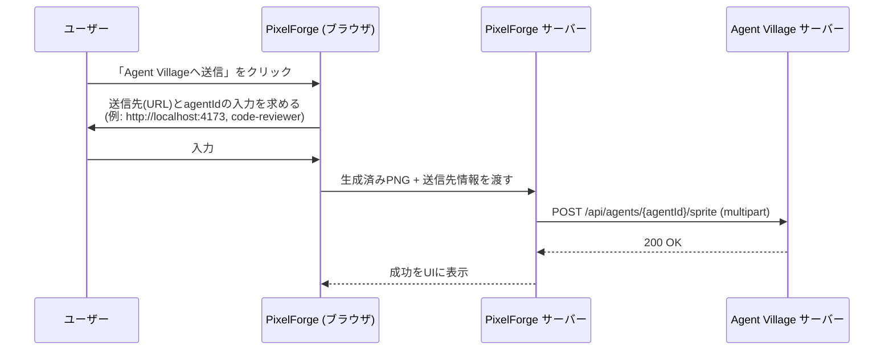

# 05. Agent Villageとの連携 — PixelForge

対象読者: 実装者。
関連: `00-overview.md`（連携をスコープに含める理由）、`02-conversion-pipeline.md`（出力フォーマット）。

---

## 1. 前提: 出力フォーマットの互換性

PixelForgeの出力（`02-conversion-pipeline.md` §2⑥）は、Agent Village側の既存制約にそのまま適合するよう設計している。

| Agent Villageの制約（`public/js/hud.js`のアップロード注意書きより） | PixelForgeの対応 |
|---|---|
| PNG形式 | ⑥で常にPNG書き出し |
| 正方形（縦横同じpx数） | ②の自動トリミングで正方形に統一 |
| 16〜128px | ⑥の出力サイズ選択肢（16/32/64/128px）が範囲内 |
| 300KB以下 | 色数を絞ったドット絵PNGは通常この範囲に収まるが、書き出し時にファイルサイズを検証し、超過時は警告する |

→ **Agent Village側のコード変更は不要。** 既存の`/api/agents/:id/sprite`アップロードAPI（`server/src/index.js`）がそのまま使える。

## 2. 連携方法A: 手動エクスポート（既定・シンプル）

1. PixelForgeでプレビューを確認し、「ダウンロード」でPNGを保存する。
2. Agent Villageのダッシュボードで対象エージェントを選択→「見た目」欄→保存したPNGをアップロードする（`docs/setup.md` §8）。

追加のコード連携が一切不要で、両ツールが完全に独立したまま使える。**汎用ソフトとしての独立性を保つ既定の連携方法。**

## 3. 連携方法B: 直接送信（任意・ワンクリック）

PixelForgeのUIに「Agent Villageへ送信」ボタンを追加する。PixelForge（Python/FastAPI）とAgent Village（Node.js/Express）は言語が異なるが、連携は単純なHTTP multipartリクエスト（Python側は`requests`/`httpx`で送信、`01-architecture.md` §3）なので支障はない。

- Agent Village側のURL・ポートは環境ごとに違う（`docs/operations-guide.md` §2〜3）ため、**決め打ちせず毎回ユーザーに入力させる**（自動検出はしない）。理由: 誤って別プロジェクト向けの既存インスタンスに送りつけてしまう事故を避けるため。`docs/operations-guide.md`で確立した「勝手に他プロジェクトのインスタンスに触らない」という運用方針と一貫させる。
- 送信対象のagentIdは、事前にAgent Village側の`/api/snapshot`を叩いて一覧取得→選択式にできるとより親切（v2候補）。初期実装では手入力でよい。

## 4. 実装の優先順位

| フェーズ | 内容 |
|---|---|
| P0 | PixelForge単体（変換パイプライン＋手動エクスポート）。Agent Villageとは無関係に動作確認できる状態にする |
| P1 | 連携方法A（手動アップロード）の動作確認。コード変更なしで既に成立するはずなので、実際にAgent Village側へアップロードして通ることを確認するのみ |
| P2 | 連携方法B（直接送信ボタン）の実装 |
